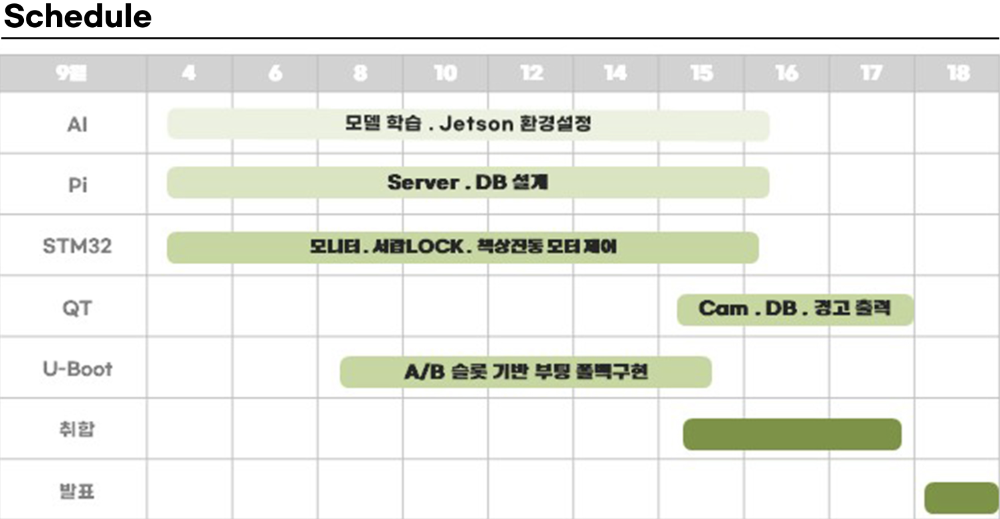
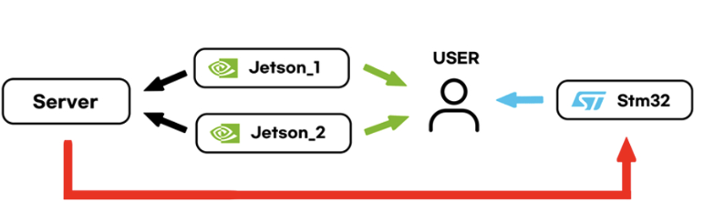
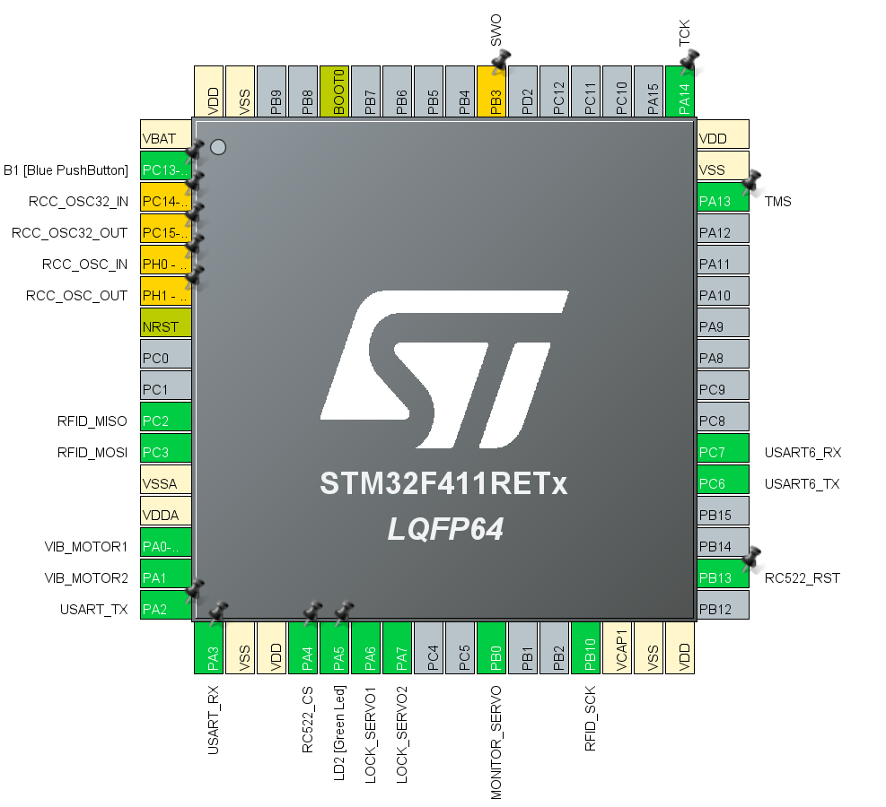

# 사용자의 얼굴 및 자세, 행동 인식을 통한 Smart Desk
Intel Edge AI Team 4

## 프로젝트 기능
- 올바른 자세를 유도해서 장시간 업무 가능
- 졸음 감지를 통한 사용자 깨우기
- 사용자가 자리를 비웠을 경우 물건 도난 방지
- 출퇴근 기능을 활용한 확실한 출퇴근 시간 기록

## 팀 구성 및 역할
|팀원|역할
|:---:|:---|
|[김민수](https://github.com/KimMS-99)|프로젝트 총괄 관리<br>라즈베리파이 U-Boot slot기반 A/B fallback 구현
|[조아빈](https://github.com/abin1303)|STM32 기반 하드웨어 제어 펌웨어 설계 및 구현 <br>FreeRTOS를 이용한 태스크 관리 및 멀티태스킹 구조 설계 <br>CPU 부하를 줄이고 실시간성을 확보하기 위한 DMA/인터럽트 기반 데이터 처리 구조 구현
|[설영현](https://github.com/seol1006a)|UART 디바이스 드라이버 작성 및 직렬 통신 구현<br>AI 모듈, Qt 애플리케이션과의 TCP/소켓 통신 서버 개발<br>DB 설계 및 관리
|[서우진](https://github.com/Woojin5020)|mediapipe Facemesh 모델을 통한 얼굴 인증 및 사용자 인식, 졸음 감지 구현<br>mediapipe pose 모델을 활용한 거북목 자세 인식
|[이호빈](https://github.com/hb1no) |YOLOv8s + 자체 데이터셋(400장, COCO) 기반 커스텀 자세 인식 모델 설계·학습 <br> YOLOv8n-pose(프리트레인 COCO-17)로 웹캠 실시간 추정<br> 허리굽음/다리꼬기 판별 구현<br> Flask MJPEG 스트리밍·TensorRT 최적화·IoT 신호 연동 <br>커스텀 vs 프리트레인 모델 비교·성능 검증(앉은 환경 특화 vs 일반 상황 안정성)

## 개발 일정


## 시스템 아키텍처


## 설치 및 환경 설정

### 테스트된 환경
- **Ubuntu**: 22.04 (Python 3.10)
- **Jetson**: JetPack 4.6
- **Raspberry Pi 4**: Raspberry Pi OS (kernel `6.12.33`)
- **STM32**: F411RE (STM32CubeIDE)

### AI 모델 (Target: Ubuntu/Jetson)

AI 모델은 사용자의 자세, 졸음, 부재 여부를 감지합니다. Ubuntu 데스크톱 환경과 NVIDIA Jetson 환경에 맞게 각각 설정해야 합니다.

#### 공통 패키지 설치

```bash
# 시스템 라이브러리 설치
sudo apt-get update
sudo apt-get install -y python3-pip cmake libjpeg8-dev
```

#### Python 의존성 설치

- **Ubuntu 환경인 경우:**
  ```bash
  pip3 install -r ai/woojin/intel7_team4/requirements/ubuntu/requirements.txt
  ```

- **NVIDIA Jetson 환경인 경우:**
  ```bash
  pip3 install -r ai/woojin/intel7_team4/requirements/jetson/requirements.txt
  ```

#### MJPG-Streamer 설치 (웹캠 스트리밍)

AI 모델이 웹캠 영상을 사용하기 위해 `mjpg-streamer`를 설치합니다.

```bash
# 소스 코드 폴더로 이동
cd ai/woojin/intel7_team4/annotation/AUTH_neck_eye_QT/mjpg-streamer-master/mjpg-streamer-experimental

# 빌드 및 설치
make
sudo make install
```

#### 실행

- **자세 인식 모델 실행 (예시):**
  ```bash
  python3 ai/hobin/run_yolov8_posture_web.py
  ```
- **메인 AI 애플리케이션 실행 (예시):**
  ```bash
  python3 ai/woojin/intel7_team4/last_test/main.py
  ```

---

### Qt GUI 애플리케이션 (Target: Ubuntu Desktop)

사용자 인터페이스를 제공하는 Qt 애플리케이션을 설정합니다.

#### 필요 라이브러리 설치

```bash
sudo apt-get update
sudo apt-get install -y qtbase5-dev qtmultimedia5-dev libgstreamer1.0-dev libgstreamer-plugins-base1.0-dev
```

#### 빌드 및 실행

```bash
# 프로젝트 폴더로 이동
cd Qt/Intel_project_team4

# qmake를 사용하여 Makefile 생성
qmake

# 빌드
make

# 실행
./Intel_project_team4
```

---

### Raspberry Pi 서버 및 드라이버 (Target: Raspberry Pi)

Raspberry Pi에서 동작하는 메인 서버와 UART 디바이스 드라이버를 설정합니다.

#### 필요 라이브러리 설치

```bash
sudo apt-get update
sudo apt-get install -y build-essential libmysqlclient-dev raspberrypi-kernel-headers
```

#### art 설정

```ini
# config.txt에 추가
dtoverlay=uart3
```
```bash
# 리스타트
sudo reboot

# uart3 설정 확인
pinctrl get 4,5
# 아래처럼 나오면 정상
4: a4    pn | hi // GPIO4 = TXD3
5: a4    pu | hi // GPIO5 = RXD3
```

#### 서버 빌드

```bash
# 서버 프로젝트 폴더로 이동
cd rpi/Sever

# 빌드
make
```

#### 실행

- **서버 실행:**
  ```bash
  cd rpi/Server
  ./server
  cd ../../
  ```
- **드라이버 모듈 로드:**
  ```bash
  sudo insmod rpi/device_driver/uart3_driver_irq.ko
  ```

---

### STM32 펌웨어 (Target: STM32F411RE)

RFID 카드 리더 및 잠금장치를 제어하는 펌웨어입니다.


#### 빌드 및 업로드

- **STM32CubeIDE** 또는 **VSCode**와 같은 개발 환경에서 `stm32/locker_uart_freeRTOS` 프로젝트를 열어 빌드 및 업로드합니다.

## 문서 및 프로토콜

- 통신 규약: [docs/protocol.md](./docs/protocol.md)
- 시스템 설계: [docs/Architecture_Sequence.md](./docs/Architecture_Sequence.md)
- A/B 업데이트(U-Boot, rollback): [docs/AB_fallback.md](./docs/AB_fallback.md)
- 시연 영상/PPT: [media/](./media/) (Git LFS)