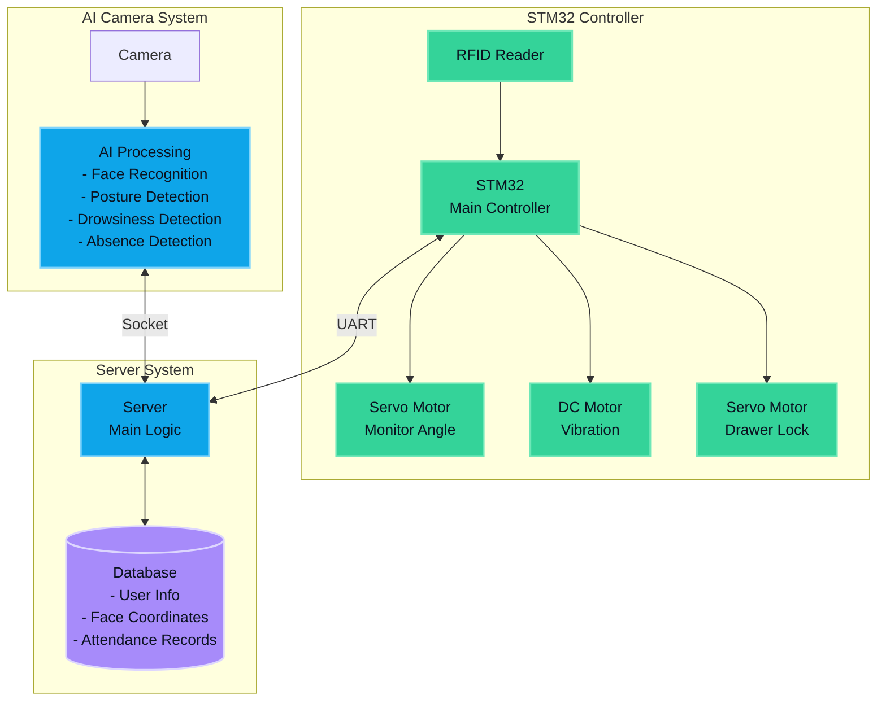
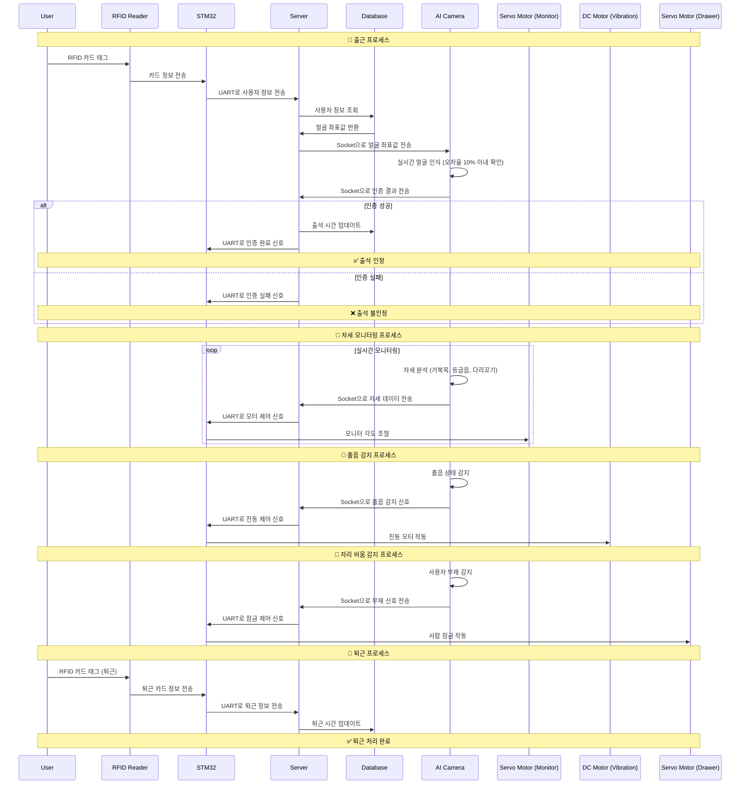

## 시스템 아키텍처

```mermaid
%%{init: {"theme":"base","themeVariables":{
  "background":"#0B1220",          /* 전체 배경색 */
  "primaryColor":"#111827",
  "primaryBorderColor":"#94A3B8",
  "primaryTextColor":"#E5E7EB",
  "lineColor":"#94A3B8",
  "tertiaryColor":"#1F2937"
}}}%%
graph TB
    subgraph "STM32 Controller"
        RFID[RFID Reader]
        SERVO_MONITOR[Servo Motor<br/>Monitor Angle]
        DC_MOTOR[DC Motor<br/>Vibration]
        SERVO_DRAWER[Servo Motor<br/>Drawer Lock]
        STM32[STM32<br/>Main Controller]
        RFID --> STM32
        STM32 --> SERVO_MONITOR
        STM32 --> DC_MOTOR
        STM32 --> SERVO_DRAWER
    end
    
    subgraph "Server System"
        SERVER[Server<br/>Main Logic]
        DB[(Database<br/>- User Info<br/>- Face Coordinates<br/>- Attendance Records)]
        SERVER <--> DB
    end
    
    subgraph "AI Camera System"
        CAMERA[Camera]
        AI[AI Processing<br/>- Face Recognition<br/>- Posture Detection<br/>- Drowsiness Detection<br/>- Absence Detection]
        CAMERA --> AI
    end
    
    STM32 <-->|UART| SERVER
    AI <-->|Socket| SERVER
    
    classDef processBox fill:#0EA5E9,stroke:#7DD3FC,stroke-width:2px,color:#0B1220
    classDef dataBox fill:#A78BFA,stroke:#DDD6FE,stroke-width:2px,color:#0B1220
    classDef hardwareBox fill:#34D399,stroke:#6EE7B7,stroke-width:2px,color:#0B1220
    
    class STM32,RFID,SERVO_MONITOR,DC_MOTOR,SERVO_DRAWER hardwareBox
    class SERVER,AI processBox
    class DB dataBox
```

```mermaid
sequenceDiagram
    participant U as User
    participant R as RFID Reader
    participant S as STM32
    participant SV as Server
    participant DB as Database
    participant AI as AI Camera
    participant SM as Servo Motor (Monitor)
    participant DM as DC Motor (Vibration)
    participant SD as Servo Motor (Drawer)

    %% 출근 프로세스
    Note over U,SD: 🔵 출근 프로세스
    U->>R: RFID 카드 태그
    R->>S: 카드 정보 전송
    S->>SV: UART로 사용자 정보 전송
    SV->>DB: 사용자 정보 조회
    DB->>SV: 얼굴 좌표값 반환
    SV->>AI: Socket으로 얼굴 좌표값 전송
    
    AI->>AI: 실시간 얼굴 인식 (오차율 10% 이내 확인)
    AI->>SV: Socket으로 인증 결과 전송
    
    alt 인증 성공
        SV->>DB: 출석 시간 업데이트
        SV->>S: UART로 인증 완료 신호
        Note over U,SD: ✅ 출석 인정
    else 인증 실패
        SV->>S: UART로 인증 실패 신호
        Note over U,SD: ❌ 출석 불인정
    end
    
    %% 자세 교정 프로세스
    Note over U,SD: 🔵 자세 모니터링 프로세스
    loop 실시간 모니터링
        AI->>AI: 자세 분석 (거북목, 등굽음, 다리꼬기)
        AI->>SV: Socket으로 자세 데이터 전송
        SV->>S: UART로 모터 제어 신호
        S->>SM: 모니터 각도 조절
    end
    
    %% 졸음 감지 프로세스
    Note over U,SD: 🔵 졸음 감지 프로세스
    AI->>AI: 졸음 상태 감지
    AI->>SV: Socket으로 졸음 감지 신호
    SV->>S: UART로 진동 제어 신호
    S->>DM: 진동 모터 작동
    
    %% 자리 비움 감지 프로세스
    Note over U,SD: 🔵 자리 비움 감지 프로세스
    AI->>AI: 사용자 부재 감지
    AI->>SV: Socket으로 부재 신호 전송
    SV->>S: UART로 잠금 제어 신호
    S->>SD: 서랍 잠금 작동
    
    %% 퇴근 프로세스
    Note over U,SD: 🔵 퇴근 프로세스
    U->>R: RFID 카드 태그 (퇴근)
    R->>S: 퇴근 카드 정보 전송
    S->>SV: UART로 퇴근 정보 전송
    SV->>DB: 퇴근 시간 업데이트
    Note over U,SD: ✅ 퇴근 처리 완료
```